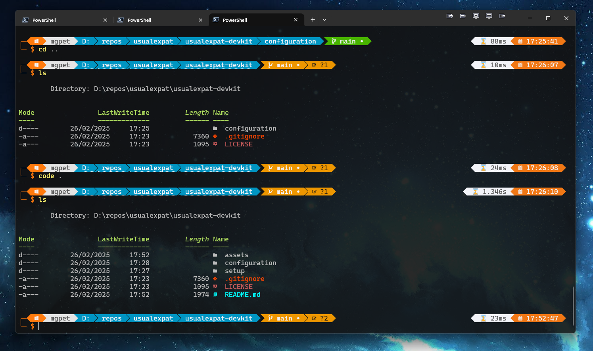

# 🚀 Devkit by Usual Expat

## 🔹 What

This repository provides a **pragmatic, versatile, and visually appealing** configuration setup for developers. It includes:  

- **Git** – Streamlined config with useful aliases and signing setup  
- **PowerShell** – Custom profiles, productivity scripts, and automation  
- **Windows Terminal** – Beautiful themes, shortcuts, and profiles  
- **.NET Project Templates** – Ready-to-use templates designed for **Azure DevOps** and **Terraform**  
- **DevOps & Terraform Integration** – Optimized for cloud-native workflows  

Everything is designed to be **easy to set up, powerful, and visually refined**.



**Note**: this is very much work in progress, and the configuration provided is rather custom to my needs, so might need some edits to make sure it suits your needs. Sharing early as the terminal configuration was requested by a friend. The plan is to make the installation and management of configs easy and user friendly, making sure that setting up a new box for development is automated and personalised to the user.

---

## 🔹 How  

### 🚀 **Installation & Setup**

1. **Clone this repo**

   ```powershell
   git clone https://github.com/mgpeter/usualexpat-devkit.git
   cd usualexpat-devkit
   ```

2. **Run the Interactive Installation Wizard**

   Run as admin in PowerShell 7+:

   ```powershell
   . "./configuration/install.ps1"
   ```

   The wizard will guide you through:
   - **Repository Locations** - Select where you store your code
   - **Git Configuration** - Set up your name, email, and directory-specific profiles
   - **PowerShell Modules** - Choose which modules to install (z, posh-git, Terminal-Icons, etc.)
   - **Oh-My-Posh Theme** - Select your terminal theme

   The wizard automatically:
   - Backs up your existing configuration files
   - Generates `.gitconfig` with your settings
   - Creates directory-specific Git profiles (e.g., different email for work repos)
   - Updates your PowerShell profile
   - Installs selected modules

3. **Restart your terminal and enjoy!**

### ⚡ **PowerShell Features**

The DevKit includes a powerful set of PowerShell features to enhance your development workflow:

#### 🎨 **Visual Enhancements**

- **Oh My Posh** integration with a modern, informative prompt
- **Terminal Icons** for better file type visualization
- **Syntax highlighting** for better code readability
- **Auto-suggestions** for command completion

#### 🛠️ **Productivity Tools**

- **Directory Navigation**
  - `z` command for quick directory jumping
  - Enhanced `cd` with directory history
  - Directory stack management

- **Git Integration**
  - `posh-git` for enhanced git status and branch information
  - Git aliases for common operations
  - Branch management shortcuts

- **Command History**
  - Enhanced history search with `Ctrl+R`
  - History-based suggestions
  - Better history navigation

#### 🔧 **Custom Aliases**

- `yesterday` - Show commits from yesterday
- `recently` - Show commits from the last 3 days
- `standup` - Show commits since last standup
- `lg` - Enhanced git log with graph view
- `ls` - Pretty git log with decorations
- `la` - All branches git log
- `ll` - Detailed git log with changes
- `amend` - Quick amend last commit

#### ⚙️ **Configuration Management**

- **Profile System**
  - Modular profile structure
  - Easy customization
  - Automatic module loading

- **Environment Variables**
  - Centralized variable management
  - Profile-specific settings
  - Easy path management

#### 🔍 **Search & Navigation**

- **Fuzzy Search**
  - Quick file finding
  - Directory navigation
  - Command history search

- **Directory Bookmarks**
  - Save frequently used directories
  - Quick navigation
  - Persistent bookmarks

#### 🛡️ **Security Features**

- **Execution Policy Management**
- **Secure Credential Storage**
- **Profile Integrity Checks**

#### 📦 **Module Management**

- **Automatic Module Installation**
- **Version Management**
- **Dependency Resolution**

### 📦 **PowerShell Modules**

The DevKit uses several powerful PowerShell modules to enhance your development experience. Here's a detailed overview of each module and how to use them:

#### 🎯 **z** - Directory Jumper

- **Source**: [GitHub - rupa/z](https://github.com/rupa/z)
- **Purpose**: Quick directory navigation using frequency and recency
- **Usage**:

  ```powershell
  z <directory>     # Jump to directory
  z -l             # List all directories
  z -t             # List directories by frequency
  z -x             # Remove directory from database
  ```

#### 🎨 **Terminal Icons** - File Type Icons

- **Source**: [PowerShell Gallery - Terminal Icons](https://www.powershellgallery.com/packages/Terminal-Icons)
- **Purpose**: Adds file and folder icons to your terminal
- **Usage**:

  ```powershell
  Get-ChildItem    # Icons will be displayed automatically
  Set-TerminalIconsTheme -Theme <theme-name>  # Change icon theme
  ```

#### 🔄 **posh-git** - Git Integration

- **Source**: [GitHub - dahlbyk/posh-git](https://github.com/dahlbyk/posh-git)
- **Purpose**: Enhanced Git status and branch information
- **Features**:
  - Branch status indicators
  - File status indicators
  - Git command auto-completion
- **Usage**:

  ```powershell
  git status      # Shows enhanced status with indicators
  git checkout    # Shows branch suggestions
  ```

#### ⌨️ **PSReadLine** - Command Line Editor

- **Source**: [GitHub - PowerShell/PSReadLine](https://github.com/PowerShell/PSReadLine)
- **Purpose**: Enhanced command-line editing experience
- **Features**:
  - Syntax highlighting
  - Better history search
  - Improved tab completion
- **Usage**:

  ```powershell
  Ctrl+R          # Search command history
  Ctrl+Space      # Show completion menu
  Ctrl+Shift+Space # Show completion menu with descriptions
  ```

#### 🎭 **Oh My Posh** - Prompt Customization

- **Source**: [GitHub - JanDeDobbeleer/oh-my-posh](https://github.com/JanDeDobbeleer/oh-my-posh)
- **Purpose**: Beautiful and informative terminal prompts
- **Features**:
  - Git status integration
  - Environment information
  - Custom themes
- **Usage**:

  ```powershell
  oh-my-posh init pwsh --config <theme-path> | Invoke-Expression
  ```

#### 🔍 **PSFzf** - Fuzzy Finder

- **Source**: [GitHub - kelleyma49/PSFzf](https://github.com/kelleyma49/PSFzf)
- **Purpose**: Fuzzy file and command finding
- **Usage**:

  ```powershell
  Ctrl+T           # Fuzzy file finder
  Ctrl+R           # Fuzzy command history
  Alt+C            # Fuzzy directory navigation
  ```

#### 🛠️ **PSFzf** - Directory Navigation

- **Source**: [PowerShell Gallery - PSFzf](https://www.powershellgallery.com/packages/PSFzf)
- **Purpose**: Enhanced directory navigation with fuzzy finding
- **Usage**:

  ```powershell
  Set-PsFzfOption -PSReadlineChordProvider 'Ctrl+t' -PSReadlineChordReverseHistory 'Ctrl+r'
  ```

#### 📊 **PSFzf** - Git Status

- **Source**: [PowerShell Gallery - PSFzf](https://www.powershellgallery.com/packages/PSFzf)
- **Purpose**: Enhanced git status with fuzzy finding
- **Usage**:

  ```powershell
  git status | Fzf | Out-String | Invoke-Expression
  ```

#### 🔒 **CredentialManager** - Credential Management

- **Source**: [PowerShell Gallery - CredentialManager](https://www.powershellgallery.com/packages/CredentialManager)
- **Purpose**: Secure credential storage and retrieval
- **Usage**:

  ```powershell
  Add-Credential -Target "git:https://github.com" -UserName "username" -Password "password"
  Get-Credential -Target "git:https://github.com"
  ```

#### 📦 **Module Management**

All modules are automatically installed during the DevKit setup. To manually update modules:

```powershell
Update-Module -Name <module-name> -Force
```

To see all installed modules and their versions:

```powershell
Get-Module -ListAvailable | Where-Object { $_.Name -in @('z', 'Terminal-Icons', 'posh-git', 'PSReadLine', 'PSFzf', 'CredentialManager') }
```

#### ⚙️ **Customization**

Each module can be customized through its configuration file or environment variables. Check the respective module's documentation for detailed customization options.

### 🚀 **Azure DevOps Pipeline Automation**

The DevKit includes powerful Azure DevOps pipeline automation capabilities that can automatically generate and configure pipelines based on your repository structure.

#### 🔍 **Solution Discovery**
- **Project Analysis**
  - Automatic detection of solution files (.sln)
  - Project type identification (Web Apps, Functions, Libraries)
  - Framework version detection
  - Test project identification
  - Dependencies analysis

- **Azure Resource Detection**
  - Azure Web App detection
  - Azure Functions detection
  - Azure Key Vault integration
  - Azure SQL Database detection
  - Other Azure service dependencies

#### 🛠️ **Pipeline Generation**
- **Build Pipelines**
  - Multi-stage builds
  - Framework-specific build steps
  - Test execution
  - Code coverage reporting
  - Artifact generation

- **Release Pipelines**
  - Environment-specific deployments
  - Azure service deployments
  - Configuration management
  - Secret management
  - Health checks

#### 🔄 **Automation Features**
- **Template Selection**
  - Framework-specific templates
  - Project type templates
  - Custom template support
  - Template versioning

- **Configuration Management**
  - Environment variables
  - Build parameters
  - Release variables
  - Secret management

#### 🔒 **Security & Authentication**
- **Azure PAT Management**
  - Secure token storage
  - Token rotation
  - Scope management
  - Access control

- **Service Principal Integration**
  - Azure service authentication
  - Role-based access
  - Managed identities

#### 📊 **Monitoring & Reporting**
- **Pipeline Analytics**
  - Build success rates
  - Test coverage trends
  - Deployment statistics
  - Performance metrics

- **Health Monitoring**
  - Resource health checks
  - Application monitoring
  - Log aggregation
  - Alert configuration

#### 🎯 **Usage Example**
```powershell
# Initialize Azure DevOps pipeline automation
Initialize-AzDevOpsPipeline -Organization "your-org" -Project "your-project" -PatToken "your-pat-token"

# Generate pipeline for a solution
New-AzDevOpsPipeline -SolutionPath "path/to/solution.sln" -Environment "dev" -DeployToAzure $true

# Configure deployment settings
Set-AzDevOpsDeploymentConfig -Environment "dev" -ResourceGroup "my-rg" -WebAppName "my-app"

# Generate and apply pipeline
Invoke-AzDevOpsPipelineGeneration
```

#### ⚙️ **Configuration Options**
```powershell
# Pipeline configuration
$pipelineConfig = @{
    BuildConfiguration = "Release"
    TestCoverageThreshold = 80
    ArtifactRetentionDays = 30
    DeploymentEnvironments = @("dev", "staging", "prod")
    AzureResources = @{
        WebApps = $true
        Functions = $true
        KeyVault = $true
    }
}

# Apply configuration
Set-AzDevOpsPipelineConfig -Config $pipelineConfig
```

#### 🔍 **Supported Project Types**
- ASP.NET Core Web Applications
- Azure Functions
- .NET Class Libraries
- .NET Core Console Applications
- Blazor Applications
- XUnit Test Projects
- NUnit Test Projects
- MSTest Projects

#### 📦 **Required Azure DevOps Extensions**
- Azure Pipelines
- Azure Artifacts
- Azure Repos
- Azure Test Plans
- Azure Boards

#### ⚠️ **Prerequisites**
- Azure DevOps Organization
- Azure Subscription
- Azure Service Principal
- Azure Key Vault (optional)
- Azure Application Insights (optional)

#### 🔄 **Pipeline Templates**
The DevKit includes pre-built templates for common scenarios:
- Web App deployment
- Function App deployment
- Container deployment
- Database deployment
- Test automation
- Security scanning

#### 🛡️ **Security Best Practices**
- Secure variable management
- Secret rotation
- Access control
- Audit logging
- Compliance checks

#### 📈 **Future Enhancements**
- Multi-region deployment support
- Blue-green deployment
- Canary releases
- A/B testing
- Performance testing
- Security scanning
- Compliance validation

---

## 🔹 Who  

This kit is for **developers, DevOps engineers, and power users** who want:  

✅ A **polished** and **efficient** development environment  
✅ Quick but **flexible** setup for Git, PowerShell, and Windows Terminal  
✅ Ready-to-go **.NET templates** for **Azure DevOps** and **Terraform** projects  
✅ A **beautiful** CLI experience without hassle  

Whether you're a **beginner looking for a strong starting point** or a **seasoned developer** looking to streamline your workflow, this kit will help you get up and running fast! 🚀  

## 🔹 Status

- ✔️ Initial git and powershell configs **[DONE]**

  - Powershell configuration including useful modules and **oh-my-posh**
  - Multi-account setup for git

- ✔️ Automated install scripts **[DONE]**

  - ✔️ automated installation of powershell modules
  - ✔️ automated installation of git configuration with interactive setup

- ✔️ Azure DevOps Pipeline Automation module **[DONE]**

  - ✔️ Solution analysis and project type detection
  - ✔️ Azure dependency detection
  - ✔️ YAML pipeline generation

- ✔️ Interactive CLI Installation Wizard **[DONE]**

  - ✔️ Rich console UI with PwshSpectreConsole
  - ✔️ Repository location configuration
  - ✔️ Git profile setup (default + directory-specific profiles)
  - ✔️ PowerShell module selection
  - ✔️ Oh-My-Posh theme selection
  - ✔️ Automatic backup of existing configs
  - ✔️ Update mode for existing installations

- ❌ Windows Terminal configuration **[TO DO]**

- ❌ Generic Terraform templates and shared code **[TO DO]**

- ❌ .NET project templates for Azure DevOps **[TO DO]**
