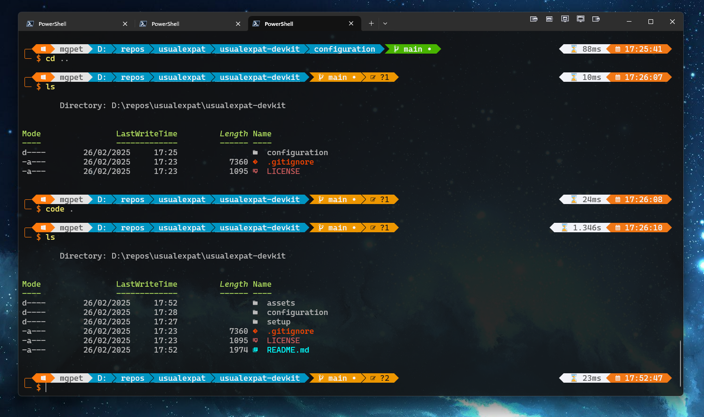

# Devkit by Usual Expat

## What

This repository provides a **pragmatic, versatile, and visually appealing** configuration setup for developers. It includes:  

- **Git** – Streamlined config with useful aliases and signing setup  
- **PowerShell** – Custom profiles, productivity scripts, and automation  
- **Windows Terminal** – Beautiful themes, shortcuts, and profiles  
- **Claude Code & Herdr** – Optionally install Claude agents, skills, commands, and global `CLAUDE.md`, plus the herdr terminal-multiplexer configuration

Everything is designed to be **easy to set up, powerful, and visually refined**.



**Note**: this is very much work in progress, and the configuration provided is rather custom to my needs, so might need some edits to make sure it suits your needs. Sharing early as the terminal configuration was requested by a friend. The plan is to make the installation and management of configs easy and user friendly, making sure that setting up a new box for development is automated and personalised to the user.

---

## How

### Prerequisites

Install these **before** running the wizard. [winget](https://learn.microsoft.com/windows/package-manager/winget/) is preferred (it ships with Windows 11); direct installers are listed where the tool exposes one. **Open a new terminal after installing** so `PATH` updates take effect — each installer adds its own binary to `PATH` (see [A note on PATH](#a-note-on-path)).

**Required**

| Tool | Why | Install |
| --- | --- | --- |
| PowerShell 7+ | The wizard and generated profile require it (`#Requires -Version 7.0`) | `winget install --id Microsoft.PowerShell -e` |
| Git | Git config generation + aliases | `winget install --id Git.Git -e` |
| Oh My Posh | The profile calls `oh-my-posh` by name to render the prompt | `winget install --id JanDeDobbeleer.OhMyPosh -e` |
| A Nerd Font | Glyphs/icons in the prompt and Terminal-Icons | `oh-my-posh font install meslo` (after installing Oh My Posh), then set it as your terminal font |

> `PwshSpectreConsole` (the wizard UI) and the selected PowerShell modules (`z`, `posh-git`, `Terminal-Icons`, `PSReadLine`, …) are installed automatically from the PowerShell Gallery — no manual step and no `PATH` change.

**Optional (only if you enable the matching feature)**

| Tool | Needed for | Install |
| --- | --- | --- |
| Neovim | The bundled Neovim config, or Neovim as the Git editor | `winget install --id Neovim.Neovim -e` |
| Node.js | General dev workflows (and npm-based Claude Code install) | `winget install --id OpenJS.NodeJS.LTS -e` |
| Claude Code CLI | Using the Claude agents/skills/commands the wizard installs into `~/.claude` | Native (recommended): `irm https://claude.ai/install.ps1 \| iex` (installs to `%USERPROFILE%\.local\bin`) &nbsp;·&nbsp; or npm: `npm install -g @anthropic-ai/claude-code` |
| Herdr | Using the herdr terminal-multiplexer configuration/skill | Windows: see [herdr.dev](https://herdr.dev) (installs to `%LOCALAPPDATA%\Programs\Herdr\bin`) &nbsp;·&nbsp; macOS/Linux: `brew install herdr` or `curl -fsSL https://herdr.dev/install.sh \| sh` |

> The wizard installs the Claude assets to `~/.claude` and writes the herdr config to `%APPDATA%\herdr` **regardless** of whether the Claude Code / Herdr binaries are present — but you need the respective CLI installed to actually use them.

### Installation & Setup

1. **Clone this repo**

   ```powershell
   git clone https://github.com/mgpeter/usualexpat-devkit.git
   cd usualexpat-devkit
   ```

2. **Run the Interactive Installation Wizard**

   Run as admin in PowerShell 7+:

   ```powershell
   . "./configuration/install.ps1"
   ```

   The wizard will guide you through:
   - **Repository Locations** - Select where you store your code
   - **Git Configuration** - Set up your name, email, and directory-specific profiles
   - **Git Editor** - Pick your commit message editor (VS Code, Neovim, Vim, Notepad++, Nano, or custom)
   - **PowerShell Modules** - Choose which modules to install (z, posh-git, Terminal-Icons, etc.)
   - **Oh-My-Posh Theme** - Select your terminal theme
   - **Neovim Configuration** - Optionally install the bundled Neovim config
   - **Claude Code & Herdr** - Optionally install Claude agents, skills, commands, and `CLAUDE.md` into `~/.claude`, plus the herdr configuration (each area is individually toggleable)

   The wizard automatically:
   - Backs up your existing configuration files
   - Generates `.gitconfig` with your settings
   - Creates directory-specific Git profiles (e.g., different email for work repos)
   - Updates your PowerShell profile
   - Installs selected modules
   - Installs the selected Claude Code assets and merges the herdr `SessionStart` hook into `~/.claude/settings.json` without touching your other settings
   - Discovers the installed PowerShell 7 (`pwsh`) path and writes it into `%APPDATA%\herdr\config.toml`

3. **Restart your terminal and enjoy!**

### A note on PATH

**The devkit installer does not modify your `PATH`.** It writes configuration to `~/.devkit`, `~/.claude`, and `%APPDATA%\herdr` — all of which are loaded by your PowerShell profile (`$PROFILE`) or read directly by the tools, so none of them require `PATH` entries. PowerShell modules install into the module path, not `PATH`.

What *does* need to be on `PATH` is the [prerequisite tools](#prerequisites) — and each tool's own installer adds itself:

| Tool | Location its installer adds to `PATH` |
| --- | --- |
| `pwsh` | `%LOCALAPPDATA%\Microsoft\WindowsApps` (Store/winget alias) |
| `oh-my-posh` | `%LOCALAPPDATA%\Programs\oh-my-posh\bin` |
| `git` | `C:\Program Files\Git\cmd` |
| `nvim` | `C:\Program Files\Neovim\bin` |
| `claude` | `%USERPROFILE%\.local\bin` (native install) |
| `herdr` | `%LOCALAPPDATA%\Programs\Herdr\bin` |
| `node` / `npm` | `C:\Program Files\nodejs` |

Because the generated PowerShell profile calls `oh-my-posh` (and, if you set it as the Git editor, `nvim`) **by name**, make sure those are on `PATH` before your first new session — i.e. **open a fresh terminal after installing the prerequisites** so the updated `PATH` is picked up, then run the wizard.

> Herdr, by design, pins its shell to the **App Execution Alias** `pwsh` shim (`%LOCALAPPDATA%\Microsoft\WindowsApps\pwsh.exe`) rather than a version-stamped path, so it survives PowerShell updates. The wizard detects this automatically.

### PowerShell Features

The DevKit includes a powerful set of PowerShell features to enhance your development workflow:

#### Visual Enhancements

- **Oh My Posh** integration with a modern, informative prompt
- **Terminal Icons** for better file type visualization
- **Syntax highlighting** for better code readability
- **Auto-suggestions** for command completion

#### Productivity Tools

- **Directory Navigation**
  - `z` command for quick directory jumping
  - Enhanced `cd` with directory history
  - Directory stack management

- **Git Integration**
  - `posh-git` for enhanced git status and branch information
  - Git aliases for common operations
  - Branch management shortcuts

- **Command History**
  - Enhanced history search with `Ctrl+R`
  - History-based suggestions
  - Better history navigation

#### Custom Aliases

- `yesterday` - Show commits from yesterday
- `recently` - Show commits from the last 3 days
- `standup` - Show commits since last standup
- `lg` - Enhanced git log with graph view
- `ls` - Pretty git log with decorations
- `la` - All branches git log
- `ll` - Detailed git log with changes
- `amend` - Quick amend last commit

#### Configuration Management

- **Profile System**
  - Modular profile structure
  - Easy customization
  - Automatic module loading

- **Environment Variables**
  - Centralized variable management
  - Profile-specific settings
  - Easy path management

#### Search & Navigation

- **Fuzzy Search**
  - Quick file finding
  - Directory navigation
  - Command history search

- **Directory Bookmarks**
  - Save frequently used directories
  - Quick navigation
  - Persistent bookmarks

#### Security Features

- **Execution Policy Management**
- **Secure Credential Storage**
- **Profile Integrity Checks**

#### Module Management

- **Automatic Module Installation**
- **Version Management**
- **Dependency Resolution**

### PowerShell Modules

The DevKit uses several powerful PowerShell modules to enhance your development experience. Here's a detailed overview of each module and how to use them:

#### z - Directory Jumper

- **Source**: [GitHub - rupa/z](https://github.com/rupa/z)
- **Purpose**: Quick directory navigation using frequency and recency
- **Usage**:

  ```powershell
  z <directory>     # Jump to directory
  z -l             # List all directories
  z -t             # List directories by frequency
  z -x             # Remove directory from database
  ```

#### Terminal Icons - File Type Icons

- **Source**: [PowerShell Gallery - Terminal Icons](https://www.powershellgallery.com/packages/Terminal-Icons)
- **Purpose**: Adds file and folder icons to your terminal
- **Usage**:

  ```powershell
  Get-ChildItem    # Icons will be displayed automatically
  Set-TerminalIconsTheme -Theme <theme-name>  # Change icon theme
  ```

#### posh-git - Git Integration

- **Source**: [GitHub - dahlbyk/posh-git](https://github.com/dahlbyk/posh-git)
- **Purpose**: Enhanced Git status and branch information
- **Features**:
  - Branch status indicators
  - File status indicators
  - Git command auto-completion
- **Usage**:

  ```powershell
  git status      # Shows enhanced status with indicators
  git checkout    # Shows branch suggestions
  ```

#### PSReadLine - Command Line Editor

- **Source**: [GitHub - PowerShell/PSReadLine](https://github.com/PowerShell/PSReadLine)
- **Purpose**: Enhanced command-line editing experience
- **Features**:
  - Syntax highlighting
  - Better history search
  - Improved tab completion
- **Usage**:

  ```powershell
  Ctrl+R          # Search command history
  Ctrl+Space      # Show completion menu
  Ctrl+Shift+Space # Show completion menu with descriptions
  ```

#### Oh My Posh - Prompt Customization

- **Source**: [GitHub - JanDeDobbeleer/oh-my-posh](https://github.com/JanDeDobbeleer/oh-my-posh)
- **Purpose**: Beautiful and informative terminal prompts
- **Features**:
  - Git status integration
  - Environment information
  - Custom themes
- **Usage**:

  ```powershell
  oh-my-posh init pwsh --config <theme-path> | Invoke-Expression
  ```

#### PSFzf - Fuzzy Finder

- **Source**: [GitHub - kelleyma49/PSFzf](https://github.com/kelleyma49/PSFzf)
- **Purpose**: Fuzzy file and command finding
- **Usage**:

  ```powershell
  Ctrl+T           # Fuzzy file finder
  Ctrl+R           # Fuzzy command history
  Alt+C            # Fuzzy directory navigation
  ```

#### PSFzf - Directory Navigation

- **Source**: [PowerShell Gallery - PSFzf](https://www.powershellgallery.com/packages/PSFzf)
- **Purpose**: Enhanced directory navigation with fuzzy finding
- **Usage**:

  ```powershell
  Set-PsFzfOption -PSReadlineChordProvider 'Ctrl+t' -PSReadlineChordReverseHistory 'Ctrl+r'
  ```

#### PSFzf - Git Status

- **Source**: [PowerShell Gallery - PSFzf](https://www.powershellgallery.com/packages/PSFzf)
- **Purpose**: Enhanced git status with fuzzy finding
- **Usage**:

  ```powershell
  git status | Fzf | Out-String | Invoke-Expression
  ```

#### CredentialManager - Credential Management

- **Source**: [PowerShell Gallery - CredentialManager](https://www.powershellgallery.com/packages/CredentialManager)
- **Purpose**: Secure credential storage and retrieval
- **Usage**:

  ```powershell
  Add-Credential -Target "git:https://github.com" -UserName "username" -Password "password"
  Get-Credential -Target "git:https://github.com"
  ```

#### Module Management

All modules are automatically installed during the DevKit setup. To manually update modules:

```powershell
Update-Module -Name <module-name> -Force
```

To see all installed modules and their versions:

```powershell
Get-Module -ListAvailable | Where-Object { $_.Name -in @('z', 'Terminal-Icons', 'posh-git', 'PSReadLine', 'PSFzf', 'CredentialManager') }
```

#### Customization

Each module can be customized through its configuration file or environment variables. Check the respective module's documentation for detailed customization options.

---

## Who

This kit is for **developers, DevOps engineers, and power users** who want:

- A **polished** and **efficient** development environment
- Quick but **flexible** setup for Git, PowerShell, and Windows Terminal
- A **beautiful** CLI experience without hassle

Whether you're a **beginner looking for a strong starting point** or a **seasoned developer** looking to streamline your workflow, this kit will help you get up and running fast.

## Status

- ✔️ Initial git and powershell configs **[DONE]**

  - Powershell configuration including useful modules and **oh-my-posh**
  - Multi-account setup for git

- ✔️ Automated install scripts **[DONE]**

  - ✔️ automated installation of powershell modules
  - ✔️ automated installation of git configuration with interactive setup

- ✔️ Azure DevOps Pipeline Automation module **[DONE]**

  - ✔️ Solution analysis and project type detection
  - ✔️ Azure dependency detection
  - ✔️ YAML pipeline generation

- ✔️ Interactive CLI Installation Wizard **[DONE]**

  - ✔️ Rich console UI with PwshSpectreConsole
  - ✔️ Repository location configuration
  - ✔️ Git profile setup (default + directory-specific profiles)
  - ✔️ PowerShell module selection
  - ✔️ Oh-My-Posh theme selection
  - ✔️ Automatic backup of existing configs
  - ✔️ Update mode for existing installations

- ✔️ Claude Code & Herdr integration **[DONE]**

  - ✔️ Install Claude agents, skills, commands, and global `CLAUDE.md` into `~/.claude` (each area toggleable)
  - ✔️ Idempotent merge of the herdr `SessionStart` hook into `~/.claude/settings.json`
  - ✔️ Auto-discovery of the installed `pwsh` path for `%APPDATA%\herdr\config.toml`
